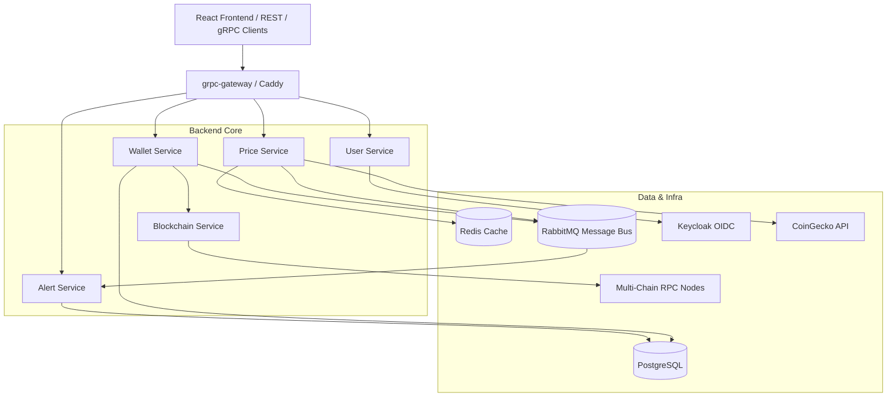

# Architecture Overview

Whale Tracker uses a service-oriented architecture designed for low-latency market data fetching, event-driven balance updates, and gRPC/REST dual-protocol access.

## High-Level System Architecture

## Protocol Buffers & gRPC Gateway

All API contracts are defined under `proto/` using Protocol Buffers. The service uses `grpc-gateway` to compile native gRPC services into HTTP REST endpoints simultaneously.

### Proto Packages

- `proto/price/v1/price.proto`: Token catalogs, market prices, streaming feeds, and metadata lookup.
- `proto/wallet/v1/wallet.proto`: Wallet lifecycle management and historical balance retrieval.
- `proto/user/v1/user.proto`: User identity and profile management.
- `proto/alert/v1/alert.proto`: User alert definitions and notifications.

## Data & Event Flows

1. **Balance Sync:** The `Blockchain Service` queries chain-specific RPC endpoints (ETH, BTC, SOL, TRX, ARB, Base, Polygon, XRP). Balances and historical states are persisted in PostgreSQL.
2. **Price Updates:** The `Price Service` fetches live rates from CoinGecko, caches active price states in Redis, and pushes updates into RabbitMQ.
3. **Alert Triggers:** The `Alert Service` consumes balance and price event updates from RabbitMQ and triggers notifications when predefined thresholds are met.